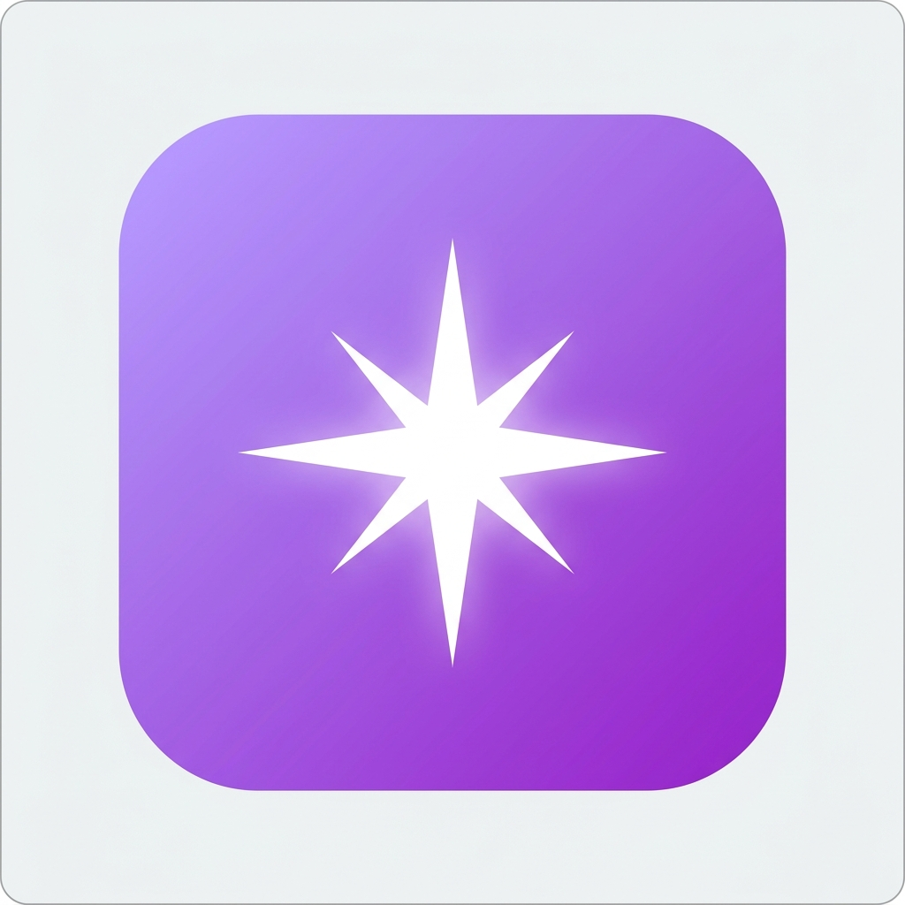

# Techy Tharun's Chatbox 🚀

A high-performance, premium AI assistant powered by **GPT-4o**. Featuring a sleek, humanized interface and optimized for speed.



## ✨ Features

- **Extreme Performance**: Parallelized backend operations for near-zero latency streaming.
- **Humanized UI**: Empathetic authentication flow and sleek, modern glassmorphism design.
- **Multi-Device Support**: Optimized for the local network and PWA-ready for mobile installation.
- **Advanced Tools**: Supports file attachments (PDF, Doc, TXT), voice input, and markdown rendering.
- **Personalized Branding**: Fully customized experience under the "Techy Tharun" identity.

## 🛠️ Technology Stack

- **Framework**: Next.js 15 (App Router, Turbopack)
- **Styling**: Tailwind CSS + Framer Motion
- **Authentication**: NextAuth.js (v5 Beta)
- **Database**: Prisma ORM with Neon (Serverless PostgreSQL)
- **AI Engine**: OpenRouter (GPT-4o)
- **Language**: TypeScript

## 🚀 Getting Started

### 1. Clone the repository
```bash
git clone https://github.com/Tharun4743/Tharun-s-Chatbox.git
cd Tharun-s-Chatbox
```

### 2. Install dependencies
```bash
npm install
```

### 3. Environment Variables
Create a `.env.local` file with the following:
```env
DATABASE_URL=
NEXTAUTH_SECRET=
NEXTAUTH_URL=http://localhost:3000
OPENROUTER_API_KEY=
```

### 4. Run the development server
```bash
npm run dev
```

## 🏗️ Deployment

This project is optimized for deployment on **Render** via the provided `render.yaml` blueprint.

1. Connect your repository to Render.
2. Select **Blueprint**.
3. Set your secret environment variables in the dashboard.

---
Made with ❤️ by [Techy Tharun](https://github.com/Tharun4743)
